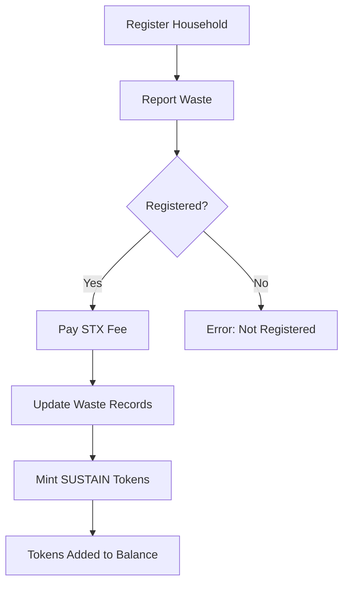

# Community Waste Collection Smart Contract

[](https://docs.stacks.co/clarity)
[](https://opensource.org/licenses/MIT)
[]()

A blockchain-based community waste management system built on the Stacks blockchain using Clarity smart contracts. This decentralized application (dApp) incentivizes proper waste disposal by rewarding participating households with SUSTAIN tokens.

## 🌟 Overview

The Community Waste Collection system creates a transparent, incentive-driven ecosystem for waste management. Households register on the platform, report their waste collection, pay collection fees in STX, and receive SUSTAIN tokens as rewards for proper waste disposal.

### Key Features

- **Household Registration**: Households can register to participate in the waste collection program
- **Waste Reporting & Payment**: Registered households report waste amounts and pay collection fees in STX
- **Token Rewards**: Participants earn SUSTAIN tokens (10 tokens per kg of waste) as incentives
- **SIP-010 Compliant**: SUSTAIN token follows the SIP-010 fungible token standard
- **Admin Controls**: Contract owner can withdraw collected STX funds for project operations

## 🏗️ Architecture

### Smart Contract Structure

```
contracts/
└── community_waste.clar    # Main smart contract
```

### Core Components

| Component | Description |
|-----------|-------------|
| **SUSTAIN Token** | SIP-010 fungible token with 6 decimals |
| **Household Registry** | Maps household addresses to registration status and waste metrics |
| **Fee Collection** | STX payment system for waste collection services |
| **Reward System** | Automated token minting for waste reporting |

## 📋 Contract Functions

### Public Functions

| Function | Parameters | Description |
|----------|------------|-------------|
| `register-household` | None | Register the caller as a participating household |
| `report-and-pay` | `waste-kg: uint`, `fee-per-kg: uint` | Report waste and pay collection fee |
| `transfer` | `amount: uint`, `from: principal`, `to: principal`, `memo: optional` | Transfer SUSTAIN tokens (SIP-010) |
| `withdraw` | `amount: uint` | Admin function to withdraw collected STX |

### Read-Only Functions

| Function | Parameters | Returns |
|----------|------------|---------|
| `get-name` | None | Token name ("SUSTAIN Token") |
| `get-symbol` | None | Token symbol ("SUSTAIN") |
| `get-decimals` | None | Token decimals (6) |
| `get-balance` | `who: principal` | Token balance of address |
| `get-total-supply` | None | Total token supply |
| `get-token-uri` | None | Token URI (none) |
| `get-household-info` | `addr: principal` | Household registration and metrics |
| `get-total-waste-collected` | None | Total waste collected system-wide |
| `get-total-stx-received` | None | Total STX received in fees |
| `get-contract-owner` | None | Contract owner address |

### Error Codes

| Code | Constant | Description |
|------|----------|-------------|
| u100 | `err-owner-only` | Only contract owner can call this function |
| u101 | `err-not-token-owner` | Caller is not the token owner |
| u102 | `err-insufficient-balance` | Insufficient token balance for transfer |
| u103 | `err-invalid-amount` | Invalid amount (zero or exceeds limits) |
| u401 | `err-not-registered` | Household is not registered |
| u404 | `err-insufficient-contract-balance` | Insufficient contract STX balance |
| u409 | `err-already-registered` | Household is already registered |

## 🚀 Getting Started

### Prerequisites

- [Clarinet](https://github.com/hirosystems/clarinet) v3.0+
- [Node.js](https://nodejs.org/) v18+
- npm or yarn

### Installation

1. Clone the repository:
   ```bash
   git clone https://github.com/itzbayo/community-waste-collection.git
   cd community-waste-collection
   ```

2. Install dependencies:
   ```bash
   npm install
   ```

3. Verify the contract:
   ```bash
   clarinet check
   ```

### Running Tests

Execute the comprehensive test suite:

```bash
npm test
```

The test suite includes 28 tests covering:
- Contract initialization
- Household registration
- Waste reporting and payment
- Token transfers
- Admin operations

### Local Development

Start the Clarinet console for interactive testing:

```bash
clarinet console
```

Example interactions:

```clarity
;; Register a household
(contract-call? .community_waste register-household)

;; Report 10 kg of waste with 1000 microSTX fee per kg
(contract-call? .community_waste report-and-pay u10 u1000)

;; Check token balance
(contract-call? .community_waste get-balance tx-sender)

;; View total waste collected
(contract-call? .community_waste get-total-waste-collected)
```

## 📊 How It Works

### User Flow



### Reward Calculation

For each waste report:
- **STX Fee**: `waste_kg × fee_per_kg` (in microSTX)
- **Token Reward**: `waste_kg × 10` SUSTAIN tokens

**Example**: Reporting 50 kg of waste at 1000 microSTX/kg:
- Fee: 50 × 1000 = 50,000 microSTX (0.05 STX)
- Reward: 50 × 10 = 500 SUSTAIN tokens

## 🔐 Security Features

- **Input Validation**: All inputs are validated for bounds (max 1,000,000 kg waste, max 1,000,000 microSTX/kg)
- **Authorization Checks**: Only registered households can report waste; only the owner can withdraw funds
- **Reentrancy Protection**: Clarity's design prevents reentrancy attacks
- **Integer Overflow Prevention**: Clarity's built-in uint overflow protection

## 🛠️ Development

### Project Structure

```
community-waste-collection/
├── Clarinet.toml           # Clarinet configuration
├── contracts/
│   └── community_waste.clar # Smart contract
├── settings/
│   ├── Devnet.toml         # Devnet settings
│   ├── Testnet.toml        # Testnet settings
│   └── Mainnet.toml        # Mainnet settings
├── tests/
│   └── community_waste.test.ts  # Test suite
├── package.json            # Node.js dependencies
├── tsconfig.json           # TypeScript configuration
├── vitest.config.js        # Vitest configuration
└── README.md               # This file
```

### Deployment

1. **Testnet Deployment**:
   ```bash
   clarinet deployments generate --testnet
   clarinet deployments apply -p deployments/default.testnet-plan.yaml
   ```

2. **Mainnet Deployment**:
   ```bash
   clarinet deployments generate --mainnet
   clarinet deployments apply -p deployments/default.mainnet-plan.yaml
   ```

## 🤝 Contributing

Contributions are welcome! Please feel free to submit a Pull Request.

1. Fork the repository
2. Create your feature branch (`git checkout -b feature/AmazingFeature`)
3. Commit your changes (`git commit -m 'Add some AmazingFeature'`)
4. Push to the branch (`git push origin feature/AmazingFeature`)
5. Open a Pull Request

## 📄 License

This project is licensed under the MIT License - see the [LICENSE](LICENSE) file for details.

## 🔗 Resources

- [Clarity Language Documentation](https://docs.stacks.co/clarity)
- [SIP-010 Fungible Token Standard](https://github.com/stacksgov/sips/blob/main/sips/sip-010/sip-010-fungible-token-standard.md)
- [Clarinet Documentation](https://docs.hiro.so/stacks/clarinet)
- [Stacks Blockchain](https://www.stacks.co/)

## 📧 Contact

For questions or support, please open an issue in the repository.

---

**Built with ❤️ for sustainable waste management on the Stacks blockchain**
